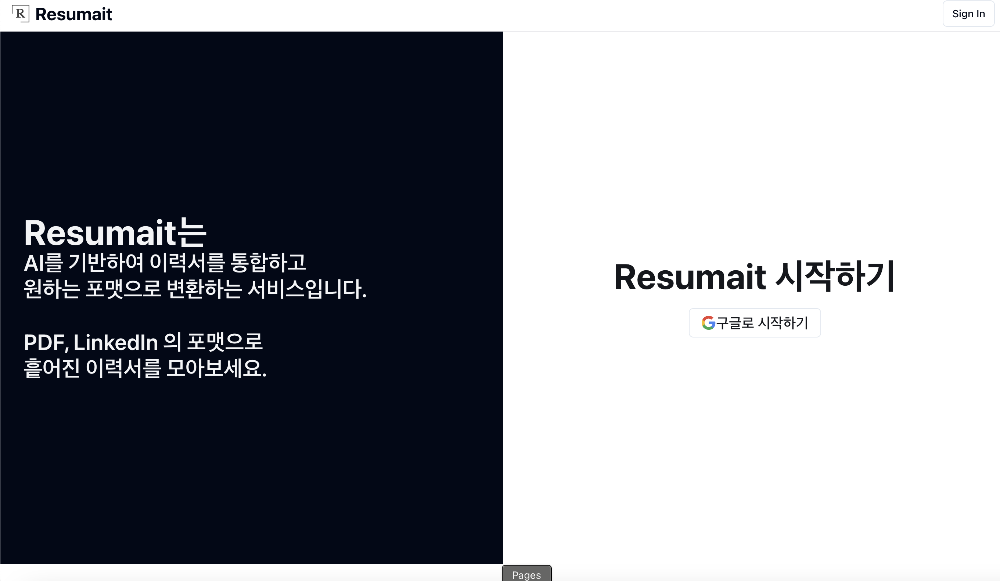

# 🚀 Resumait AI 온보딩 가이드  
안녕하세요! 😊 Resumait AI서비스를 시작하시는 여러분을 환영합니다~!
Resumait는 AI를 활용해 **이력서 & 자기소개서**를 쉽고 빠르게 작성할 수 있도록 도와주는 웹서비스 입니다. 
지원할 공고와 직무와 관련된 몇가지 정보만 입력하면 AI가 여러분만을 위한 맞춤형 지원서를 만들어 드려요! 📝✨  

On-Boarding 가이드는 여러분의 입사지원을 위해 **Resumait을 100% 활용하는 방법**을 안내해 드릴게요. 함께 시작해볼까요? 🚀  

*Resumait AI를 활용한 이력서 & 자기소개서 작성 플랫폼의 메인 화면입니다*

---

## 🎯 Resumait 서비스 소개 페이지?  
Resumait은 AI를 활용해 **더 쉽고, 더 빠르게** 이력서와 자기소개서를 만들 수 있도록 돕는 서비스입니다. 
지원하는 회사와 직무에 맞춰 **핵심 역량을 강조하고, 자연스럽게 다듬을 수 있도록** 설계되었어요.  

📌 **Resumait 서비스 소개에서 아래의 내용을 확인할 수 있어요!**  
- Resumait이 어떤 서비스인지  
- AI가 문서를 생성하는 과정  
- 실제 활용 사례  

📢 **더 자세한 내용은 → [Resumait 서비스 소개](/resumait-tutorial/introduction)**  

---

## 📂 이력서 & 자기소개서 작성하기 페이지 🚀  
처음 사용하신다면 걱정 마세요!  
아래 단계를 차례로 따라 하면 누구나 손쉽게 문서를 완성할 수 있어요. 😊  

📌 **서비스 온보딩 튜토리얼에서 확인할 수 있어요!**  
- 회원가입 및 로그인 방법  
- 기본 정보 입력 방법
- 페이지 별 사용가이드 
- 최종 저장 & 다운로드 방법  

📢 **자세한 가이드는 → [서비스 온보딩 튜토리얼](/resumait-tutorial/user-flow)**  

---

## 📝 프롬프트 작성 가이드  
AI가 원하는 방향으로 문서를 작성할 수 있도록 **프롬프트(입력 내용)를 효과적으로 작성하는 방법**을 배워보세요!  

📌 **프롬프트 가이드에서 아래 내용을 확인할 수 있어요!**  
- 자기소개서 & 이력서 작성 시 유용한 입력 방법    
- 효과적인 프롬프트 작성 예시  

📢 **더 자세한 내용은 → [프롬프트 가이드](/resumait-tutorial/prompt-guide)**  

---

## ❓ 자주 묻는 질문 (FAQ)  
서비스를 이용하면서 자주 하는 질문들을 모아두었어요! 😊  

📌 **FAQ 페이지에서 아래 내용을 확인할 수 있어요!**  
- 페이지가 불러와지지 않아요!
- 자기소개서, 이력서 생성이 오래걸려요!
- 프롬프트가이드를 따라갔음에도 올바른 자기소개서가 생성되지 않아요! 

📢 **더 자세한 해결 방법은 → [FAQ 페이지](/resumait-tutorial/faq)**  

---

## 🏠 Resumait 온보딩 튜토리얼 페이지
🔗 **[Resumait 서비스 페이지](www.resumait.xyz)**  
🔗 **[모든 포스트 보기](/resumait-tutorial/posts)**  

💡 **이제 AI가 여러분의 취업 비서로 이력서를 완벽하게 만들어드려요. 지금 바로 시작해보세요!** 🚀  